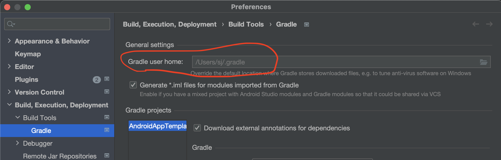

Everybody has different machine and number of cores. To have your machine responsive during builds,
edit your local
`GRADLE_USER_HOME/gradle.properties` ([docs](https://docs.gradle.org/current/userguide/build_environment.html#sec:gradle_configuration_properties))
to override project `gradle.properties`:

```properties
org.gradle.workers.max=10 # =(# of cores)-4 to have responsive machine while compiling code
org.gradle.parallel=true
org.gradle.daemon=true
org.gradle.welcome=never
# Set java home to be used by gradle
org.gradle.java.home=/Users/sj/Library/Java/JavaVirtualMachines/temurin-17.0.3/Contents/Home
```

Look for GRADLE_USER_HOME at Android Studio settings:

